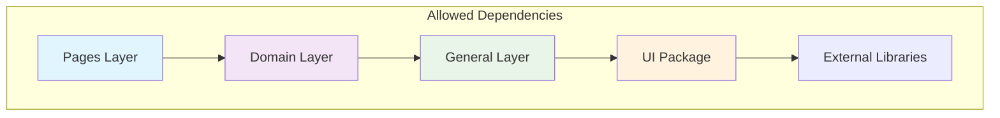
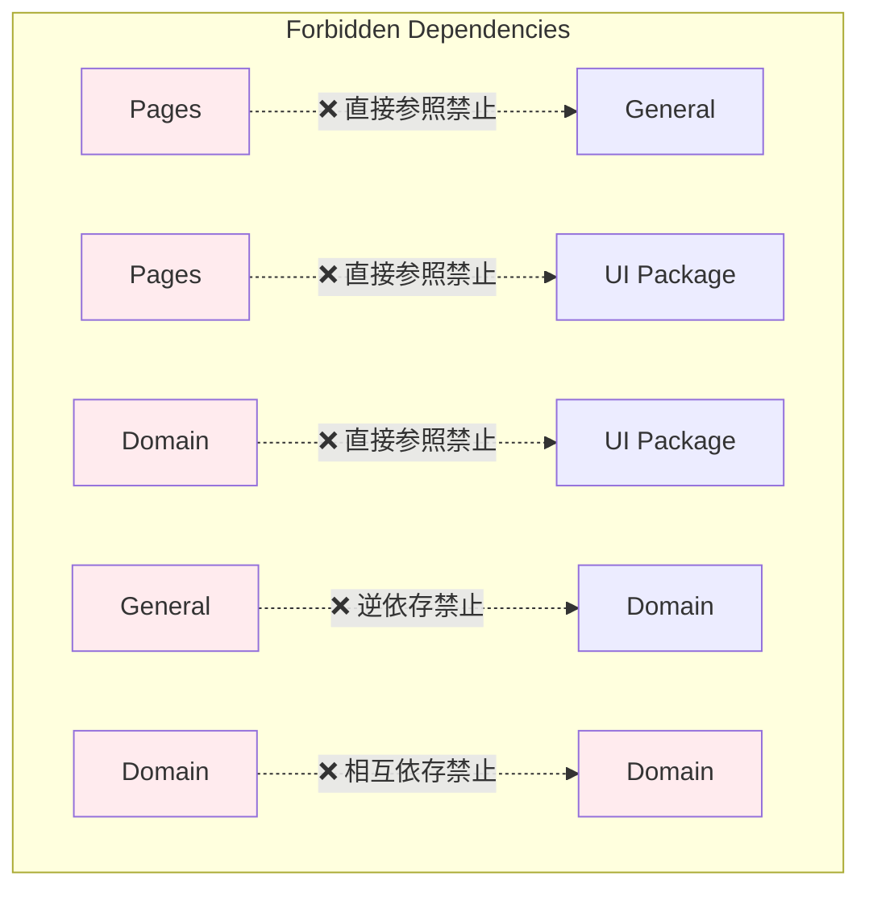

# プロジェクトアーキテクチャドキュメント

## ディレクトリ構成

### アプリケーション内の構造

```
src                               # ソースディレクトリ
├── app                           # Next.js App Router
│   ├── context                   # ログイン状態のユーザーを管理するコンテキスト
│   ├── posts                     # 投稿関連ページ
│   │   ├── [id]                  # 個別投稿ページ (動的)
│   │   └── new                   # 新規投稿ページ
│   ├── newPost.tsx               # 新規投稿コンポーネント
│   ├── signin                    # サインインページ
│   ├── signup                    # サインアップページ
│   └── users                     # ユーザー関連ページ
│       └── [id]                  # 個別ユーザーページ (動的)
│   ├── favicon.ico               # ファビコン
│   ├── globals.css               # グローバルCSS
│   ├── layout.tsx                # ルートレイアウト
│   └── page.tsx                  # ルートページ
├── components                    # 共通コンポーネント
├── constants                     # 定数ファイルのディレクトリ
├── layouts                       # レイアウトコンポーネント
├── lib                           # ライブラリ・ユーティリティ
│   ├── api                       # APIロジック
│   │   ├── auth.ts               # 認証API
│   │   └── post.ts               # 投稿API
│   ├── utils.ts                  # ユーティリティ関数
├── types                         # TypeScript型定義
│   ├── post_detail.ts            # 投稿詳細の型
│   ├── post.ts                   # 投稿の型
│   ├── reply.ts                  # 返信の型
│   └── users.ts                  # ユーザーの型
└── utils
    └── $path.ts                  # pathpida
```
### コンポーネント階層アーキテクチャ

### 依存関係ルール

#### 許可された依存関係フロー



#### 禁止された依存関係パターン



### 依存関係ルールの詳細

#### 1. ページレイヤーの制約
- **no-import-from-general-in-pages**
  - `app/**/page.tsx` から `components/general/**` への直接import禁止
  - 理由: ページは高レベルの抽象化であり、低レベルの汎用コンポーネントに直接依存すべきではない
  - 解決策: ドメインコンポーネントを経由してアクセス

#### 2. ドメインレイヤーの制約
- **no-import-from-repo-ui-in-domain**
  - `components/domain/**` から `components/ui/**` への直接import禁止
  - 理由: ドメインロジックはUI実装に依存すべきではない
  - 解決策: 汎用コンポーネントを通じてUIライブラリにアクセス

- **no-import-from-domain-in-domain**
  - `components/domain/**` 内での相互import禁止
  - 理由: ドメイン間の相互依存は循環参照を引き起こす
  - 解決策: 共通ロジックは汎用レイヤーに抽出

#### 3. ジェネラルレイヤーの制約
- **no-import-from-domain-in-general**
  - `components/general/**` から `components/domain/**` へのimport禁止
  - 理由: 汎用コンポーネントがドメイン固有ロジックに依存すると再利用性が損なわれる
  - 解決策: プロパティ経由での値の受け渡し

## まとめ

本アーキテクチャは以下の原則に基づいて設計されています。

1. **関心の分離**: 各レイヤーが明確な責任を持つ
2. **依存関係の管理**: 循環参照を避け、一方向の依存関係を維持
3. **スケーラビリティ**: 機能追加や変更に対応しやすい構造
4. **保守性**: コードの理解と修正が容易
5. **再利用性**: 共通コンポーネントとロジックの効率的な活用

このディレクトリ構成により、チーム開発における一貫性と品質を保ちながら、効率的なアプリケーション開発を実現しています。
